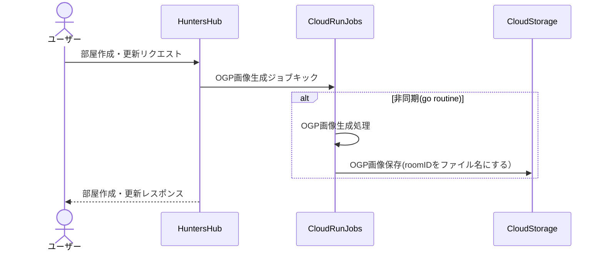

やぁ！みんな。
ハンティングライフ、楽しんでいるかな？

どうもてぃです。
この度**HuntersHub**というサービスをリリースしたので、その開発経緯や技術スタック、実装で工夫した点などを振り返りながら書きなぐっていこうと思います。


## 開発経緯

最近全くゲームは出来ていないのですが、ふとやりたいなぁと思うゲームとしてモンスターハンターポータブルシリーズがあります。
- MHP2G配信の動画を見る
- コミュニティに参加する
- 勉強・仕事しながら配信を見る
- ヤフオクでPSP3000を落札する(**もはや奇行**)
- PSPにCFWを導入してRemote Joy LiteでPCの大画面で遊べるようにする

などゲームをやらずに満足していました。
さぁ、自分でもやってみようと思い立ちやってみるのですが、やはり一人でやるのは寂しい。楽しいけど、誰かとやりたい。
乱獲勢にキャリーを頼んでもいいけれど、継続的にゲームをやるわけではないので頼むのは申し訳ない、などなど。
じゃあ、サクッと募集して一緒にやる人を見つけられるサービスがあればいいのでは？と思い立ち、AIをばりばり駆使して作ることにしました。


## 技術スタック

- バックエンド
  - Go Chi
  - GORM
- フロントエンド
  - Go Template
  - htmx
  - Alpine.js
  - TailwindCSS
- 認証
  - Supabase Auth
- データベース
  - Turso (SQLite on the Edge)
- インフラ
  - Cloud Run
  - Cloud Run Jobs (OGP画像生成)
  - Cloud Build


### なぜGoを選んだか？

- AIとの相性が良い
  - 変なコードを吐かない
- 後方互換性がある
  - 将来的にメンテナンスしやすい
- 型安全
  - バグが少ないコードを書きやすい
  - 実装した後のチェックが楽 (go buildするだけでいい)

自社開発してたときのプロダクトをまだ保守・運用しているのですが、基本Next.js, NestJSで作られており、Nodeのアプデが恐ろしいほど早く・多く、定期的にアプデをしないといけないのが辛かった（自分がインフラや保守運用を担当していたから尚更辛みがある）
お金にならないのにそんなところに時間を割きたくない…という想いが強くあり、後方互換のあるGoを選びました。
あと、単にGoが好きでプロダクトを作ってみたいという想いもありました。


### なぜchiを選んだか？


最初は`gorilla/mux`を使おうとしていましたが、もっとシンプルな書き方でサブルーターも簡単に書けるものが良いなぁと探していたところchiに出会いました。

他にも有名なGin, Echo, Fiber, Buffaloなどもありましてどれも魅力的だったのですが、最終的にドキュメントがシンプルでわかりやすかったchiを選びました。

なんかchiって可愛いですよね、読み方。


### なぜGoでフロントエンド書いた？

前述した通りです。メンテしたくないからです。
個人開発勢みんなNext.js大好きでみーんな使っていると認識しているのですが、自分は他の人と違うことをやりたがる性分というのこともあり、全く違う技術スタックを選択しました。
Nodeのアプデほんとに嫌なんですよね…。


あと、デプロイ先を1つに統一したかったという背景もあります。
Next.jsだとCloudflare WorkersかVercelになるので、わざわざバックエンドと分けてデプロイしたくなかったです。
Vercelは商用利用だと有料にしないといけないですし。
Next.jsで作ったガジェットブログの[gadgemotty](https://gadgemotty.com)はCloudflare Workersで動かしていますが、なんかめっちゃ海外からアクセスが多くて、バックエンドのSQLを発行させないように対策などを考えたり、本質とは別のところで脳のリソースが割かれるのが嫌でNext.jsの選択肢はなくなりました。

なに？Next.jsをCloud Runにデプロイすればいいじゃんって？
結局Node.jsランタイムを使うことになるから、Nodeのアプデ問題は解決しないんだよ！


### なぜhtmx, Alpine.jsを選んだのか？

シンプルに使ってみたかったからです。
YoutubeでGoの勉強をしていて、海外の方がhtmx, Alpine.js, Go templateと組み合わせて使っているチュートリアルをやってみたので選んでみました。
Next.jsなどと違ってライフサイクルを理解するのがちょっと大変でしたが、慣れてしまえばシンプルで良いなと思いました。

https://www.youtube.com/watch?v=jI3iL4c7D1Y

僕の大好きな `Anthony GG` です。
Goを勉強するならぜひ `How to Golang` のプレイリストを見てみてください。


### なぜTursoを選んだのか？

https://x.com/nil_motty93/status/1967875413595791397

当初はNeonDBのPostgreSQLを使おうとしていました。
ですが、asia-northeast1がなく一番近くてシンガポールだったので、レイテンシが気になり始めてTursoにしてみることに。
コード自体もPostgreSQLベースで作成していたのですが、Claude Codeにおまかせしてみたら30分ほどでSQLiteベースに書き換えてくれました。マジで神。
マイグレーションファイルもそこまで変更がなく、indexの貼り直しなどを行うだけで済みました。
開発環境・ステージング環境と本番環境の2つのデータベースを作成して運用していて、全く料金がかかっていないですし、速度にも全く問題がないです。
データベース100個作成無料はさすがにやりすぎｗ
レプリカもアクセス時に勝手に切り替えてくれるので、何も気にせず使用できています。（DB作成してマイグレーションしてから特に何も設定していない）


### なぜSupabase Authを選んだのか？
認証回りの実装がかなり楽で、フロントエンドにスクリプトとanon keyを埋め込むだけで使い始められるのが良かったです。
認証だけなのでRLSも気にしなくてよいですし、無料枠を超えることもまずないので、個人開発には最適解かなと思います。
注意点として、使用していないと勝手にsupabase projectがストップしてバックアップからリストアしなくちゃいけなくなるので、開発環境・ステージング環境・本番環境は分けずに同じプロジェクトで運用しています。
こうすることで開発中に認証リクエストが走り、プロジェクトがストップすることを防げます。


### なぜCloud Runを選んだのか？

ここはめっちゃ悩みました。
当初は`Render.com`や`fly.io`を使おうと思っていましたが、長期的にみて普段使用しているGoogle Cloudに統一したほうが良いと判断しました。
また、Cloud Runは最小インスタンス数を0にしておけば無料で運用できます。上記の2つは有料で$8ほどかかったキヲクですし、無料枠が小さいため選択を諦めました。
Cloud Storage, Cloud Build, Secret Managerを使いたかったというのも理由の一つです。


### なぜCloud Run Jobsを選んだのか？


OGP画像の生成を非同期で行いたかったためです。
Cloud Functionsでも良かったのですが、Cloud Run Jobsのほうがコンテナイメージをそのまま使えるので楽だったため選択しました。

部屋を作成・更新したときにCloud Run Jobsをキックし、OGP画像を生成してCloud Storageに保存しています。
roomIDをファイル名にして保存しているので、OGP画像のURLは固定で部屋詳細ページに埋め込むことができます。



こうすることで、部屋の作成・更新のレスポンスを早くし、ユーザー体験を向上させています。
お金はほぼかかっていません（そもそもユーザーまだ少ないので…）。
これゲームのバージョンごと（MHP, MHP2, MHP2G, MHP3, MHXX）に分けていて、枠の色を変えているんですよね。ちょっとしたこだわりポイントです。


## 実装で工夫した点・苦労した点

### htmx + Alpine.jsでのSPA的な体験

htmxはHTMLをレスポンスとして返すことでDOM操作を行うライブラリですが、従来のMPAとSPAの良いとこ取りをしたような感覚で開発できました。
特に部屋一覧のフィルタリングやプロフィールのタブ切り替えなど、ページ遷移なしで動的に更新できるのが良かったです。

```html
<!-- htmxでタブの内容を動的に読み込む例 -->
<button hx-get="/profile/followers" hx-target="#tab-content">
  フォロワー
</button>
```

Alpine.jsは状態管理に使用していて、モーダルの開閉やドロップダウンメニューの表示制御などに活躍しています。
Reactのようなライフサイクルを考える必要がなく、HTMLに直接書けるのでシンプルで良いですね。


### Supabase Authとバックエンドの連携

Supabase Authはフロントエンドだけで使うと楽なのですが、バックエンドとの連携がちょっと大変でした。
JWTトークンの検証、セッション管理、ユーザー情報の同期など、認証周りの実装にはそれなりに時間がかかりました。

最終的には以下のような流れで実装しています：

1. フロントエンドでSupabase Authを使ってログイン
2. JWTトークンをCookieに保存
3. バックエンドでトークンを検証してユーザー情報を取得
4. セッションを作成してユーザーIDを管理

開発環境では認証をバイパスする機能も実装していましたが、これは本番環境では使わないようにしています。


### Claude CodeとCodexを使った開発効率化

このプロジェクトは6割以上Claude Codeに書いてもらいました。
特にPostgreSQLからSQLiteへの移行は30分ほどで完了し、マイグレーションファイルやリポジトリ層のコード、モデル定義など全て自動で書き換えてくれました。

CLAUDE.mdという設定ファイルをリポジトリに置いておくと、プロジェクトのルールや技術スタック、コーディング規約などを理解して実装してくれるので、めちゃくちゃ便利です。
実装ログを必ず残すようにルール化していて、何をいつ実装したのかが追跡しやすくなっています。

またClaude Codeが実装したものを毎度Codexにチェックしてもらい、バグや改善点を指摘してもらうことで品質を担保しています。

https://x.com/nil_motty93/status/1988992110348103686

注意点として、AIが書いたコードは必ず自分で確認すること。
特にセキュリティ関連やビジネスロジックは、AIの提案をそのまま受け入れるのではなく、しっかりレビューすることが大切です。


### レスポンシブデザインの実装

モバイルとデスクトップで異なるUIを提供するのに苦労しました。
特にヘッダーのナビゲーションは、モバイルではハンバーガーメニュー、デスクトップでは横並びのメニューとして表示する必要があり、TailwindCSSのブレイクポイントを活用しています。

```html
<!-- デスクトップのみ表示 -->
<div class="hidden md:flex">
  <a href="/login">ログイン</a>
</div>

<!-- モバイルのみ表示 -->
<div class="md:hidden">
  <button>☰</button>
</div>
```

レスポンシブ対応は最初から意識しておかないと後で修正するのが大変なので、早めに取り組んで良かったです。


## 主要機能の紹介

### 部屋の作成・参加・管理


ユーザーは簡単に部屋を作成でき、他のユーザーが参加できます。
部屋には以下の情報を設定できます：

- ゲームバージョン（MHP, MHP2, MHP2G, MHP3, MHXX）
- 部屋名
- 説明
- パスワード（任意）
- 参加可能人数

部屋の作成者は部屋の管理者となり、参加者をキックしたり部屋を閉じたりできます。

まだキック機能は実装していませんが、今後追加予定です。
ブロック機能も入れると部屋の参加などややこしくなるので、慎重に設計していきたいと思います。


### ゲームバージョン別のフィルタリング


トップページでは、ゲームバージョンごとに部屋を絞り込めるようになっています。
htmxを使って非同期で部屋一覧を更新し、ページ遷移なしでフィルタリングできます。

各ゲームバージョンには固有の色を設定していて、一目でどのゲームの部屋かわかるようにしています。


### プロフィール機能


ユーザーはプロフィールページで以下の情報を設定・表示できます：

- アバター画像（Cloud Storageに保存）
- ユーザー名
- 自己紹介
- お気に入りゲーム
- プレイ時間帯
- プラットフォームID（PSN、Nintendo、Twitterなど）

フォロー・フォロワー機能もあり、気になるユーザーをフォローできます。
（現在は表示のみで、実際のフォロー・アンフォロー機能は開発中です）

ちょっとデザインが絶妙にダサいので今後改善していきたいところ…。


## 開発期間とコスト

### 開発期間

本格的に開発を始めてから約2ヶ月で最初のリリースまで持っていきました。
（途中、仕事や他のことで手が止まっていた期間も含めると3ヶ月くらい）

Claude Codeをフル活用したので、一人でもこれだけのスピードで開発できました。
特にマイグレーションやボイラープレートコードの生成は圧倒的に効率化されています。


### 運用コスト

現在の月額運用コストは**ほぼ0円**です。

- Cloud Run：最小インスタンス0で運用（アクセスがあるときだけ起動）
- Turso：無料枠内で運用（DBインスタンス100個まで無料）
- Supabase：認証のみで無料枠内
- Cloud Storage：画像保存で数円程度
- Cloud Build：デプロイ時のみ使用で無料枠内

ユーザーが増えてきたらコストは上がると思いますが、スケールに合わせて課金されるので安心です。
個人開発でこれだけの機能を無料で運用できるのは、本当にありがたいですね。


### AIツールの活用

Claude Code, Codexを併用して開発しています。
特にClaude Codeはプロジェクト全体の文脈を理解して実装してくれるので、大規模な変更も安心して任せられます。

開発時間の7割はAIとの対話で、残り3割がレビューとテストという感じです。
AIがコードを書いてくれる時代、本当に便利ですね。


## 今後の展望

### 実装予定の機能

現在、以下の機能を実装予定です：

- **フォロー・アンフォローの表示**：DBスキーマはあるので、UI実装のみ
- **お知らせ機能**：フォローされたときや部屋に参加されたときに通知
- **ユーザー検索機能**：他のユーザーを検索して見つけられるように
- **ブロック機能**：迷惑なユーザーをブロックできるように
- **問い合せ一覧機能**：同じ悩みや問合せを送ったユーザー同士で繋がれるように


などなど、これらの機能は優先度をつけて順次実装していきます。


### ユーザーからのフィードバック対応

実際にリリースしてみて、ユーザーからのフィードバックを受けて改善していきたいです。
UIの使いづらさやバグ、欲しい機能などがあれば、お問い合わせやTwitterで教えてもらえると嬉しいです。


## まとめ

個人開発は初めてではないですが、Goでフルスタック開発をしたのは今回が初めてでした。
Next.jsやNestJSに比べて学習コストは高かったですが、後方互換性やメンテナンス性を考えると、長期運用には向いていると感じました。

特にhtmx + Alpine.jsの組み合わせは、シンプルで理解しやすく、SPAのような体験を提供できるので気に入っています。
Reactのような大規模なフレームワークが必要ない場合は、この組み合わせをおすすめします。

AIツールの活用も大きかったです。
Claude Codeのおかげで、一人でも短期間でここまで作り込めました。
これからの時代、AIと協力して開発するのが当たり前になっていくんでしょうね。


### 最後に

HuntersHubをぜひ使ってみてください！
モンハンポータブルシリーズが好きな方、一緒に遊ぶ仲間を探している方、ぜひ部屋を作ってSNSで募集してみましょ！

フィードバックやバグ報告、機能要望など、お待ちしています。

https://huntershub.net/contact

それでは、良い狩りを！
